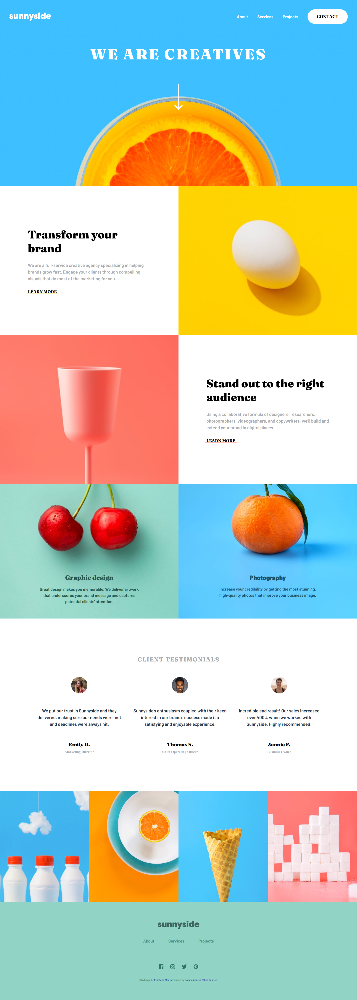

# Frontend Mentor - Sunnyside agency landing page solution

Esta es una solución para el desafío de [Frontend Mentor - Sunnyside agency landing page challenge](https://www.frontendmentor.io/challenges/sunnyside-agency-landing-page-7yVs3B6ef).

## Tabla de contenido

- [Descripción](#descripción)
- [Desafío](#desafío)
- [Captura de pantalla](#captura-de-pantalla)
- [Enlace al proyecto](#enlace-al-proyecto)
- [Proceso de desarrollo](#proceso-de-desarrollo)
  - [Tecnologías utilizadas](#tecnologías-utilizadas)
  - [Desarrollo continuo](#desarrollo-continuo)
- [Sobre mí](#sobre-mí)

## Descripción

### Desafío

Los usuarios deberían poder:

- Ver el diseño óptimo del sitio según el tamaño de pantalla de su dispositivo
- Ver los efectos hover para todos los elementos interactivos en la página

### Captura de pantalla

Aquí muestro el resultado del proyecto en una pantalla de escritorio:

### Enlace al proyecto

- URL del proyecto publicado: [Aquí estará el enlace del sitio en GitHub Pages](https://camilo-atb.github.io/sunnyside-landing-page/)

## Proceso de desarrollo

### Tecnologías utilizadas

En este proyecto utilicé:

- **HTML5 semántico** para asegurar una estructura clara y accesible.
- **Flexbox** para organizar los elementos de forma flexible y responsiva.
- **Propiedades personalizadas de CSS** para mantener consistencia en los estilos.
- **Enfoque mobile-first**, garantizando una experiencia óptima en dispositivos móviles.
- **JavaScript** para dar interactividad al usuario.

### Desarrollo continuo

En este proyecto me di cuenta de que debo mejorar en la parte del nombramiento de clases en HTML (técnica BEM), ya que el no dominar esto puede ser motivo para crear código repetitivo y bastantes problemas de mantenimiento a futuro.

## Sobre mí

- **LinkedIn** - [Camilo Andrés Téllez Benítez](http://www.linkedin.com/in/camilo-téllez)
- **Frontend Mentor** - [@camilo-atb](https://www.frontendmentor.io/profile/camilo-atb)
- **YouTube** - [Camilo Téllez](https://www.youtube.com/@camilotellez887)

Gracias por pasar por este proyecto. ✨
